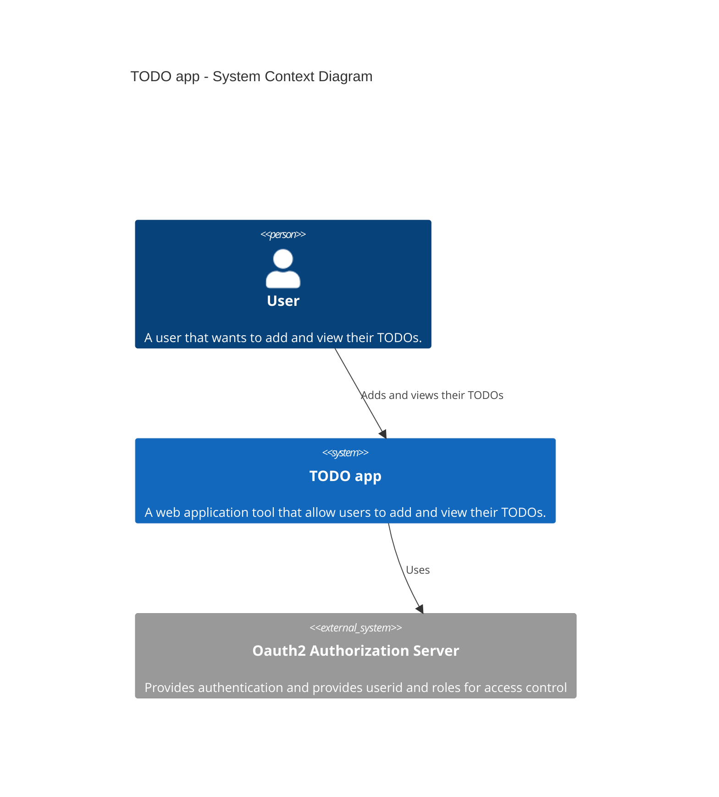
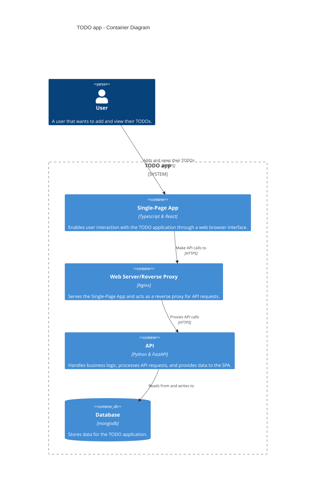
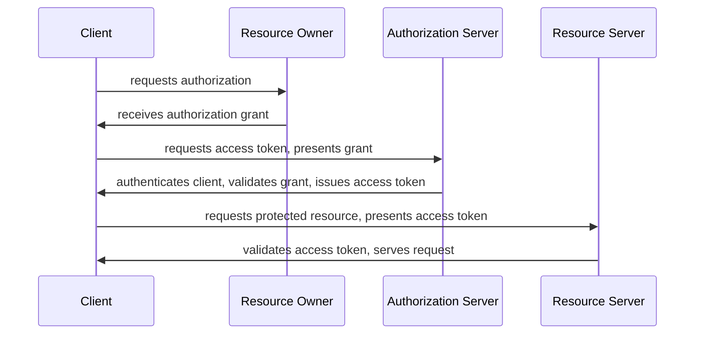
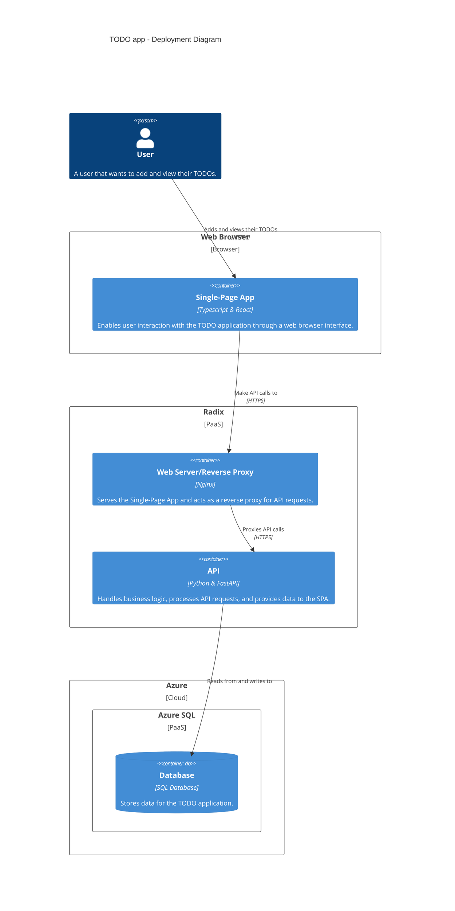

# Runbook

_This document covers operational and administrative information for the application,
and should be used to understand how the system is configured and functions,
including how to perform deployments, updates, and incident responses._

> NOTE! This is a template runbook, and as such you will have to adapt it to your application needs.

## Links

> _Quick access to essential resources and communication channels related to the application's development and operation._

- [GitHub Repository][github-repository]
- [GitHub Team][github-team]
- [GitHub Project][github-project]
- [Architecture Contract][architecture-contract]
- [IT Application (Configuration Item)][it-application-url]
- [Slack: Open Channel][slack-open]
- [Slack: Internal Channel][slack-internal]
- [Slack: Notifications Channel][slack-notifications] (not created)
- [Cyber Self-Assessment][cyber-self-assessment]

See [resources](#resources) section for overview of all resources used by the application.

## Overview Platforms

> _Quick overview of all platforms used._

- [ ] [DRM](https://drm.equinor.com/)
- [ ] [Omnia Classic](https://docs.omnia.equinor.com/products/Service-Offerings/#omnia-classic)
- [ ] [Omnia Standalone](https://docs.omnia.equinor.com/products/Service-Offerings/#omnia-standalone)
- [x] [Omnia Radix](https://www.radix.equinor.com)

## Prerequisites

> _List of all necessary permissions, or knowledge required to perform the tasks described in this runbook._

  
Permissions required

* **For Managing User Access**
  * Added as owner to the [Enterprise registration][enterprise-registration].
* **For Managing Radix**
  * To access the Radix console
    * Apply for the `Radix Platform Users` and `Radix Playground Users` through https://accessit.equinor.com
    * Added to the [Team Hermes Radix Admin][radix-admin-group] group that controls who can administrate the Radix application.
  * To change the `radixconfig.yaml` file
    * Added to the [GitHub repository][github-repository]
* **For Managing App registration**
  * Apply for the Application Developer role through https://accessit.equinor.com
    * Need to be a certified developer to get this role.
  * Added as owners to the Azure [App registration][app-registration]

  
Competence required

* [Radix](https://www.radix.equinor.com)
* [GitHub Actions](https://docs.github.com/en/actions)
* [Azure](https://learn.microsoft.com/en-us/azure/)
* [npm](https://docs.npmjs.com/)
* [Docker](https://docs.docker.com/)
* [React](https://react.dev/)
* [Oauth2](https://oauth.net/2/)
* [Python](https://www.python.org/)
* [Pre-commit](https://pre-commit.com/)
* [Git](https://git-scm.com/)

## Architecture Diagrams

_We are using [C4 model](https://c4model.com) for showing architecture diagrams._

  
Level 1 - System Context diagram

> _Provides a high-level overview of the system, including its purpose, main components, and how these components interact._

  
Level 2 - Container diagram

> _Provide an overview of the containers (runnable and deployable units) that executes code or stores data._

  
Authentication flow

The application uses the Authorization Code Grant Flow, with Proof Key for Code Exchange flow. It's a flow that enables a user of a Single-Page Application to safely log in, consent to permissions and fetch an access token in the JWT format. When the user calls the APIs, the access token is attached to the header as a Bearer token. This is the token the API will validate.

  
Deployment diagram

> _Shows how the containers are deployed on the infrastructure._

## Resources

> _List of all resources used by the application, including servers, databases, and cloud services._

  
Radix

**Hosted applications**

| Name                                           | Description                          |
| ---------------------------------------------- | ------------------------------------ |
| [Radix Application][radix-application-console] | The application registered in Radix. |

  
On-prem

**Servers**

| Server | User | Resource |
| ------ | ---- | -------- |
| -      | -    | -        |

  
Azure

**Subscriptions**

| Subscription                             | Description Group                                        |
| ---------------------------------------- | -------------------------------------------------------- |
| [Azure subscription][azure-subscription] | All Azure resources are located under this subscription. |

**App registrations**

| Name                                 | Description                                                      |
| ------------------------------------ | ---------------------------------------------------------------- |
| [App registration][app-registration] | The application object registered in Azure for this application. |

To make sure that the app registration are compliant:
* Add additional owner (to the Enterprise Application)
* Go to the `Branding & Properties` section and update the `Service Management Reference` to contain the App ID of the [configuration item][it-application-url].

_In order for the application to be able to authenticate users, you need an Application Registration in Azure AD that can sign in users and issue tokens._

  
Secrets, Certificates and Keys

> _Overview of all secrets and certificates used in the application._

All secrets and certificates are stored inside the [Azure Key Vault][azure-key-vault].

**Application secrets**

This table shows the secrets that must be populated in the KeyVault for every environment.

| Name             | Description                   | Used by |
| ---------------- | ----------------------------- | ------- |
| MONGODB_PASSWORD | For authenticating to mongoDB | API     |
| SECRET_KEY       | For signing JWT               | API     |

**Other secrets**

This table shows other secrets not directly used by the application.

| Secret Type           | Description                      | Created by                                   | Used by                                |
| --------------------- | -------------------------------- | -------------------------------------------- | -------------------------------------- |
| Federated Credentials | Allows GitHub to deploy to Radix | [Application registration][app-registration] | [GitHub Repository][github-repository] |

**Certificates**

| Certificate Name | Description |
| ---------------- | ----------- |
| -                | -           |

**Keys**

| Type           | Description                             | Created by                                     | Used by                                |
| -------------- | --------------------------------------- | ---------------------------------------------- | -------------------------------------- |
| Deployment Key | Allows Radix to clone GitHub repository | [Radix Application][radix-application-console] | [GitHub Repository][github-repository] |

## Administrative Tasks

> _Higher-level tasks associated with managing and configuring the system._

  
Environments and Resources Management

>  _Updating system configuration files. Deploying new versions or patches._

**Radix Environments**

> Describe how to configure and deploy Radix environments.

Configurations of Radix environments can be adjusted by modifying the `radixconfig.yaml` file in the [GitHub repository][github-repository].

Outlined below are descriptions of each environment with their respective deployment strategies.

| Environment            | Deployed how?                                                                            |
| ---------------------- | ---------------------------------------------------------------------------------------- |
| [Development][dev-url] | Automatically deployed from every commit to the main branch on GitHub                    |
| [Testing][test-url]    | Deployment is manually triggered by merging a pull-request generated from release-please |
| [Production][prod-url] | Promoted manually via the Radix web console from the Testing environment                 |

How to deploy to development environment:

  1. Create a pull request to main branch and assert that all checks passes.
  2. Merge the pull request and follow conventional commits for commit message.
  3. The development environment in Radix will now be built and deployed automatically.

How to deploy to testing environment:

  1. The release-please GitHub action runs on every commit to main, generating a changelog, and proposing a new version bump in a pull-request to main branch.
  2. Merging the release-please pull request will trigger release-please to run once again and it will detect that there has been a new release.
  3. The testing environment in Radix will now be built and deployed automatically.

How to promote testing to production environment:

  1. Go to the Radix web console and promote the application from the Testing environment to the Production environment.

**Azure Resources**

> Describe how to configure and deploy Azure resources.

Azure resources are defined using [Bicep](https://learn.microsoft.com/en-us/azure/azure-resource-manager/bicep/overview?tabs=bicep), and configuration can be adjusted by modifying the `*.bicep` files located under the `IaC/` folder.

Bicep files (found under the IaC/ folder):

* The `main.bicep` file creates the resource group (dev, staging, or prod) and calls the `resources.bicep` file to create the resources (key vault, database, app insights, etc.).
* The `app-registration.bicep` file creates the app registration used for the application.

* How to test the bicep files:

`az bicep build --file ./<FILENAME>.bicep --stdout`

`az deployment group create --resource-group <RESOURCE-GROUP-NAME> --template-file ./<FILENAME>.bicep --what-if`

How to deploy the bicep files:

> Note: azure-cli version 2.2.0 or higher is required.

Activate the Application Developer role in the Privileged Identity Management from [Azure portal](https://portal.azure.com).

Set active subscription for operations
`az account set --subscription "<SUBSCRIPTION>"`

Create a resource group for the environment
`az group create --name <RESOURCE GROUP> --location norwayeast --output table`

Deploy the main template
`az deployment group create --resource-group <RESOURCE GROUP> --template-file ./<main>.bicep --output table`

Deploy the app registration template
`az deployment group create --resource-group <RESOURCE GROUP>  --template-file ./app-registration.bicep`, then add the created service principal (or Enterprise App) as member to the [Team Hermes Radix Admin][radix-admin-group].

Teardown (this deletes everything in the resource group)
`az group delete --name <RESOURCE GROUP>`

   
Firewall and Network Configuration

> _Overview of network configurations and firewall rules._

Firewall is configured through [Access & Network Services][access-and-network-services]

   
Security Management

**Security Checks**

> _Security checks done every quarter._

| When    | Who                | Status |
| ------- | ------------------ | ------ |
| Q1 xxxx | username, username | OK     |

Tasks to perform:

* Update passwords and certificates.
* Check users and admin accesses.

**Monitoring Vulnerabilities**

> _Identifying, review and apply security patches._

* [Snyk][snyk] is used to monitor and manage security vulnerabilities in the application.
* [Dependabot][dependabot] is used to monitor and manage dependencies in the application.

**Penetration Tests**

> _Simulated cyberattacks carried out by Equinor's security analysts to identify and exploit vulnerabilities in the application._

Ordered from [here](https://equinor.service-now.com/selfservice?id=sc_cat_item&sys_id=842b03d0db86734086bf9ad5db96197c&task_sysid=d5f9bdec9763dd10993f3077f053af2f)

| Date | Result |
| ---- | ------ |
| xxxx |        |

**Threat Modelling Sessions**

> _Sessions to identify, discuss, and mitigate potential security threats to a system or application._

| Date       | Who | Threat-Modeling Report |
| ---------- | --- | ---------------------- |
| xx.xx.xxxx |     |                        |

See more about threat-modeling [here](https://appsec.equinor.com/threat-modeling/).

## Operational Tasks

> _Routine activities required to keep the system running smoothly._

  
User Management

> _Adding or removing users. Managing permissions and access controls._

Azure Active Directory (AD) handles user authentication and authorization.

* Application roles are managed in the [Application registration][app-registration] under the app roles section, here you can add roles, or remove existing ones.
* User access are managed in the [Enterprise registration][enterprise-registration] under the users and groups section, here you can add new users and groups, or remove existing ones.

  
Monitoring System Health and Usage Statistics

> _Describe how system health and security monitoring is performed._

* Application status, and logs can be monitored via the [Radix Application Console][radix-application-console], and can also from there navigate to Grafana dashboard to monitor application performance and resource utilization.
* Usage statistics of site traffic, inspect applications logs for errors or unusual activity is available in [Application Insights][application-insights].

  
Backup and Recovery

> _Provide overview of backup schedules, restoration steps, and responsible personnel._

**How backups is performed**

**How to verify backups for integrity**

**Recovery procedure**

  
Security Incidents

> _Describe how information security incidents are handled._

Security Incidents should be reported at [Equinor's Computer Security Incident Response Team](www.equinor.com/about-us/csirt) as soon as identified.

## Additional Resources

<!-- codespell:ignore-start -->
<!-- TODO: When instantiating the template - remember to review and replace links in this list. -->
<!-- See e.g. VOID project for a filled-out version: https://github.com/equinor/void2/blob/main/RUNBOOK.md -->
[github-repository]: https://github.com/equinor/template-fastapi-react
[github-team]: https://github.com/orgs/equinor/teams/team-hermes
[github-project]: https://github.com/orgs/equinor/projects/990
[architecture-contract]: #N/A
[it-application-url]: #N/A
[slack-open]: https://equinor.slack.com/archives/C03KQL9H47R
[slack-internal]: #N/A
[slack-notifications]: #N/A
[radix-admin-group]: https://portal.azure.com/#view/Microsoft_AAD_IAM/GroupDetailsMenuBlade/~/Overview/groupId/13b319d8-ee25-4b6b-97db-74bad07d2057
[radix-application-console]: #N/A
[dev-url]: #N/A
[test-url]: #N/A
[prod-url]: #N/A
[app-registration]: https://portal.azure.com/#view/Microsoft_AAD_RegisteredApps/ApplicationMenuBlade/~/Overview/appId/e022c8ac-47e6-4a28-8c1f-88e5c6e7f670/isMSAApp~/false
[enterprise-registration]: https://portal.azure.com/#view/Microsoft_AAD_IAM/ManagedAppMenuBlade/~/Overview/objectId/fa239c46-1ac4-4706-8536-6bd54f64fff2/appId/e022c8ac-47e6-4a28-8c1f-88e5c6e7f670
[application-insights]: #N/A
[azure-key-vault]: #N/A
[azure-subscription]: #N/A
[snyk]: https://app.snyk.io/org/equinor_hermes/projects
[dependabot]: https://github.com/equinor/template-fastapi-react/security/dependabot
[cyber-self-assessment]: #N/A
[access-and-network-services]: #N/A
<!-- codespell:ignore-end -->
