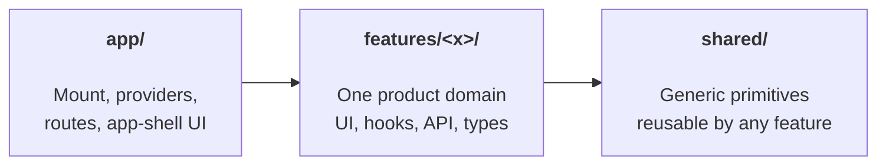
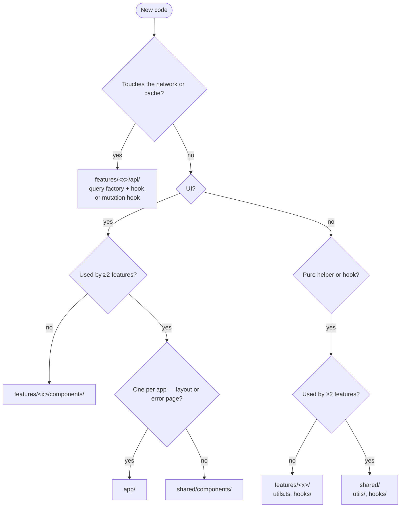
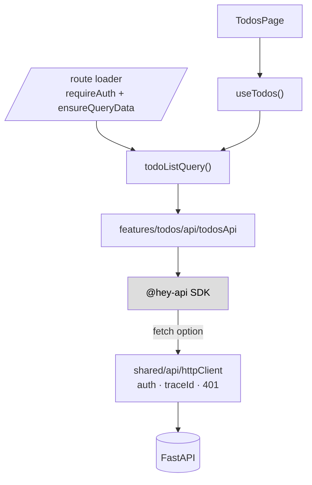

# Extending the Web

Find what you need:

- **New here?** → [The 30-second tour](#the-30-second-tour)
- **Where does my new code go?** → [Quick lookup](#quick-lookup) or [the decision tree](#decision-tree)
- **Adding a feature / route / query / mutation / form?** → [Recipes](#recipes)
- **What's the file-naming convention?** → [Naming](#naming)
- **What state container should I use?** → [State — pick the lowest tier](#state-pick-the-lowest-tier)
- **My code feels off, is it an anti-pattern?** → [Anti-patterns](#anti-patterns)
- **Where do env vars live?** → [Configuration](#configuration)

---

## The 30-second tour

The web is grouped by features. Three top-level boundaries with a strict dependency direction: **`app/` → `features/` → `shared/`**. Features never reach into each other.



```
src/
├── app/             # composition root — providers, router, app-shell
├── features/        # product domains — one folder each
│   └── todos/       # api/, components/, TodosPage.tsx, index.ts (public surface)
├── shared/          # api, platform, components, hooks, utils, theme, types
├── api-generated/   # @hey-api output — never edited by hand
├── config/          # env validation (zod-parsed import.meta.env)
└── main.tsx         # ReactDOM.createRoot — mount only
```

**Two rules cover most decisions:**

1. **One consumer → keep it in the feature. Second consumer → promote to `shared/`.**
2. **App-shell (one per app) → `app/`. Domain → `features/<x>/`. Generic primitive → `shared/`.**

---

## Quick lookup

| I want to add… | Put it in | Notes |
|---|---|---|
| A **route** | [`app/routing/router.tsx`](https://github.com/equinor/template-fastapi-react/blob/main/web/src/app/routing/router.tsx) | Lazy-load page from feature `index.ts`. Loader: `requireAuth()` + `ensureQueryData(<resource>Query())`. **Always** has `errorElement`. |
| A **page** for a feature | `features/<x>/pages/<X>Page/<X>Page.tsx` | Composition only — no `useState`, no `fetch`. |
| A **component** used by one feature | `features/<x>/pages/<X>Page/components/` (or `features/<x>/components/` if shared across pages) | Pure UI leaf. |
| A **component** used by ≥2 features | `shared/components/` | Promote on the *second* consumer, not the first. |
| An **API call** | `features/<x>/api/<x>Api.ts` | The **only** file allowed to import `@/api-generated`. |
| A **query hook** | `features/<x>/api/queries/<resource>Query.ts` (factory) + `use<Resource>.ts` (hook) | Loader and component spread the **same** factory. |
| A **mutation hook** | `features/<x>/api/mutations/use<Action>.ts` | Branch on `isError` in the component, not in `onSuccess`. |
| A **type from the API** | `features/<x>/api/schema.ts` | One zod schema → types, validation, form resolver. |
| A **cross-feature type** | `shared/types/` | API types stay in `features/<x>/api/`. |
| A **form** | Inside the feature, with `react-hook-form` + the zod schema from `api/schema.ts` | Branch on `mutation.isError` inline; never `try/catch` `mutateAsync`. |
| A **utility** | `features/<x>/utils.ts` (one consumer) → `shared/utils/` (second) | Pure. No React, no `fetch`. |
| A **hook** | Same rule as utility, with `use` prefix | Touches React. |
| A **provider** | [`app/AppProviders.tsx`](https://github.com/equinor/template-fastapi-react/blob/main/web/src/app/AppProviders.tsx) | Order: telemetry → theme → query → auth → flags. |
| A **3rd-party SDK** (Sentry, posthog, MSAL…) | `shared/platform/<area>/` | The **only** place SDKs are imported. Components import the wrapper. |
| An **env variable** | [`web/src/config/env.ts`](https://github.com/equinor/template-fastapi-react/blob/main/web/src/config/env.ts) | zod-parsed. Import `ENV`; never read `import.meta.env` directly. |

### Decision tree

If the table doesn't fit, walk the questions:



### State — pick the lowest tier

| Data | Use |
|---|---|
| Server data | TanStack Query — never Context, Redux, or Zustand |
| Route / filters / page | URL via [`nuqs`](https://nuqs.47ng.com/), route params, loaders |
| Form draft | [`react-hook-form`](https://react-hook-form.com/) |
| One component | `useState` |
| Siblings | Lift to parent |
| Global, low frequency | Context (theme, current user) |
| Global, high frequency | [Zustand](https://zustand-demo.pmnd.rs/) / [Jotai](https://jotai.org/) — Context re-renders every consumer |
| Derived | Compute during render — never store |

---

## Recipes

Concrete starting points. Reference implementation: [`web/src/features/todos/`](https://github.com/equinor/template-fastapi-react/tree/main/web/src/features/todos).

### Add a feature from scratch

1. `mkdir -p web/src/features/<x>/{api/queries,api/mutations,pages/<X>Page/components}`
2. Create the files below. Each has exactly **one** instance per resource:

    ```
    features/<x>/
    ├── api/
    │   ├── <x>Api.ts                       # only file importing @/api-generated
    │   ├── schema.ts                       # zod → types, validation, form resolver
    │   ├── keys.ts                         # aliases generator keys (getAllXQueryKey, …)
    │   ├── queries/                        # queryOptions factory + use<Resource> hooks
    │   ├── mutations/                      # use<Action> hooks
    │   └── invalidations.ts                # only when ≥2 mutations
    ├── pages/
    │   └── <X>Page/
    │       ├── <X>Page.tsx                 # composition only
    │       └── components/                 # UI leaves used only by this page
    └── index.ts                            # public surface: page, factory, shared type
    ```

    Components shared across **multiple pages** of the same feature live in `features/<x>/components/`. Promote to `shared/components/` only on the **second feature** consumer.

3. Export only the **public surface** from `index.ts`: page component, `queryOptions()` factory, shared type. Keep hooks/keys/api wrapper internal.
4. Register the route in [`app/routing/router.tsx`](https://github.com/equinor/template-fastapi-react/blob/main/web/src/app/routing/router.tsx) with `requireAuth()` + `ensureQueryData(<resource>Query())` + `errorElement`.

**Self-test:** delete `features/<x>/` — the rest of the app must still build. If it doesn't, something leaked.

### Add a query

1. In `features/<x>/api/queries/<resource>Query.ts`, write a `queryOptions()` factory. Reuse the generator's key from `keys.ts`.
2. In the same folder, write `use<Resource>.ts` that spreads the factory.
3. In `app/routing/router.tsx`, the loader spreads the **same** factory: `loader: () => qc.ensureQueryData(<resource>Query())`.

### Add a mutation

1. In `features/<x>/api/mutations/use<Action>.ts`, wrap `useMutation` and call `<x>Api.<action>()`.
2. Either inline `onSuccess: qc.invalidateQueries({ queryKey: <resource>Keys.list() })`, or — once you have ≥2 mutations — centralise in `api/invalidations.ts` and call `invalidateAll(qc, todoInvalidations.onCreate())`.
3. In the component, branch on `mutation.isError` inline. **Don't** `try/catch` `mutateAsync`. **Don't** add a global toast for the first mutation.

### Add a form

1. Reuse the zod schema from `api/schema.ts` as the `react-hook-form` resolver.
2. Don't disable submit on `!isValid` — let RHF show validation on submit.
3. On submit, call the mutation hook. Render the error inline next to the failing control.

### Add a route

1. Lazy-import the page from the feature's `index.ts` only.
2. Loader: `requireAuth()` + `ensureQueryData(<resource>Query())`.
3. **Always** attach `errorElement: <RouteErrorBoundary />`.

---

## Naming

| Thing | Pattern | Example |
|---|---|---|
| Component | `PascalCase.tsx` | `TodoList.tsx` |
| Hook | `use<Name>.ts` | `useTodos.ts` |
| Module | `camelCase.ts` | `todosApi.ts` |
| Test | `<Name>.test.tsx` next to source | `TodoList.test.tsx` |
| `queryOptions` factory | `<resource>Query.ts` | `todoListQuery.ts` |

---

## Reference

### Request flow

What happens when a user navigates to `/todos`:



On failure: `httpClient` tags the error with `traceId`, `telemetry.trackException` records, the route's `errorElement` renders `UnexpectedErrorPage` showing the traceId.

### `app/` — what each file does

App-shell UI lives here, **not** in `shared/components/` (`RootLayout`, `RouteErrorBoundary`, `NotFoundPage`, `SessionExpiredDialog` — one of each per app). A landing **route** belongs in `features/home/`.

| File | Role |
|---|---|
| [`main.tsx`](https://github.com/equinor/template-fastapi-react/blob/main/web/src/index.tsx) | Mount root. The single `./shared/api/apiClient` side-effect import wires the generated SDK through `httpClient` once. |
| [`AppProviders.tsx`](https://github.com/equinor/template-fastapi-react/blob/main/web/src/app/AppProviders.tsx) | Provider stack: telemetry → theme → query → auth → flags. `SessionExpiredDialog` is a **sibling**, listening for the `session-expired` event. |
| [`routing/router.tsx`](https://github.com/equinor/template-fastapi-react/blob/main/web/src/app/routing/router.tsx) | Lazy-loads each feature's **public surface only**. Loaders consume the **same** `queryOptions()` factory as components. **Every route gets an `errorElement`.** Only file in `app/` allowed to import from a feature. |
| [`RouteErrorBoundary.tsx`](https://github.com/equinor/template-fastapi-react/blob/main/web/src/app/routing/RouteErrorBoundary.tsx) | Renders `NotFoundPage` / `UnexpectedErrorPage` with `traceId`. |

**Auth in loaders** — the server is the security boundary; the frontend just hides what users can't do. Use `requireAuth()` + one `can(action, resource)` helper (or [CASL](https://casl.js.org/)) — never `user.role === 'admin'` in components.

### `shared/` — what each folder is for

Generic primitives every feature can use. **Features depend on `shared/`; `shared/` never depends on a feature.**

| Folder | Contents | Promotion rule |
|---|---|---|
| `api/` | [`httpClient`](https://github.com/equinor/template-fastapi-react/blob/main/web/src/shared/api/httpClient.ts), `ApiError`, `queryClient` | Single funnel for outbound HTTP — auth, traceId, 401 → `session-expired` event, error normalisation. **If you'd add `try/catch` in a query hook, the catch belongs here instead.** |
| `platform/` | `telemetry/`, `auth/`, `feature-flags/` | The **only** place 3rd-party SDKs are imported. Swap an SDK by editing one file. |
| `components/`, `hooks/` | `Button`, `useDebounce`, … | Promote on the **second** consumer. |
| `utils/` | `date`, `money`, `sanitize` | Pure. No React, no `fetch`. |
| `theme/`, `types/`, `i18n/` | Tokens, cross-feature types/strings | Feature-local versions stay in `features/<x>/`. |

`traceId` surfaces on every error page — one paste, one log search, root cause. Don't log PII, tokens, or full bodies.

!!! note "Why a custom `queryOptions()` factory and not `<resource>Options()` from the generator?"
    Use the generator's options directly only if your cache stores raw DTOs. If you normalize (e.g. `is_done` → `done`), write your own factory and reuse `getAllTodosQueryKey()` in `keys.ts` so the *key* still aligns with the generator.

---

## Anti-patterns

If something feels wrong, scan here first.

### Boundaries

| Smell | Why it hurts | Fix |
|---|---|---|
| Component calls `fetch` / generated client directly | Skips wrapper, normaliser, traceId, error normalisation. | Add a hook in `features/<x>/api/queries/`. |
| Cross-feature import past `index.ts` | Breaks public-surface contract. | Import from feature `index.ts`, or push the shared bit into `shared/`. |
| Helper added to `shared/` "just in case" | Junk drawer. | Keep in feature until a *second* caller. |
| Sentry/posthog SDK imported from a component | Telemetry bleeds; can't swap or disable in tests. | Import from `shared/platform/telemetry/` only. |
| New top-level folder (`helpers/`, `common/`, `core/`) | Bypasses the three-layer model; becomes a graveyard. | Pick `shared/utils/` or a feature folder. |
| `index.ts` exports `todoKeys` and `todosApi` | Cross-feature callers can construct keys themselves; the contract leaks. | Export the `queryOptions` factory; keep keys/api internal. |
| Intra-feature import via the feature's own `index.ts` | Circular import waiting to bite. | Use relative paths inside the feature. |

### State

| Smell | Why it hurts | Fix |
|---|---|---|
| Server data in Context or Zustand | Two caches now disagree. | TanStack Query *is* the cache. |
| Filter / page / sort in `useState` | Refresh loses it; can't share a link. | Move to URL via `nuqs`. |
| `useEffect` that fetches and `setState`s | Reinvents TanStack Query badly: no cache, no dedupe, no retry. | Replace with a query hook. |
| Business rule in `useEffect` | Runs on render path, fires twice in StrictMode, hides intent. | Derive during render, or move to event handler / `onSuccess`. |
| Inline `{queryKey, queryFn}` in a hook *and* in a loader | Two call sites drift; loader prefetches a different cache slot than the hook subscribes to. | Extract a `queryOptions()` factory; both sites spread it. |
| Inline `qc.invalidateQueries(...)` in every `onSuccess` | Invalidation graph spread across N files; easy to miss one when adding a mutation. | Centralize in `invalidations.ts`. |
| Backend DTO leaks into a prop (`is_done: boolean`) | UI depends on snake_case + nullables you didn't choose. | Normalise in wrapper; props use app shape. |
| Non-trivial computation inline in JSX | Re-derived on every render path; can't unit-test without RTL; intent hidden in markup. | Extract a pure helper in the feature. |

### Errors

| Smell | Why it hurts | Fix |
|---|---|---|
| `try/catch` around query that just `console.error`s | Swallows error; boundary never fires; user sees stale UI. | Let it throw; handle at `RouteErrorBoundary`. Use `onError` only for rollback. |
| `try/catch` around `mutateAsync` to display an error | Hides what React Query already exposes. | Branch on `mutation.isError` in the rendering component. |
| Toast system added "for mutation errors" before any second consumer | Premature `shared/` primitive; obscures *where* the failure happened. | Inline alert next to the failing control. Add a toast only when ≥2 features need it. |
| Route without `errorElement` | Silent unmount on loader failure. | Add `<RouteErrorBoundary />`. |
| `any` / `as unknown as T` near API boundary | Hides where validation belongs. | Parse with zod at the wrapper edge. |

### Hygiene

| Smell | Why it hurts | Fix |
|---|---|---|
| `dangerouslySetInnerHTML` with backend HTML | XSS by default. | Sanitise via `shared/utils/sanitize` (DOMPurify), or render as text. |
| Test imports `_privateThing` from a feature | Test blocks every refactor. | Test through public surface, or extract a pure helper. |
| `Container.tsx` + `View.tsx` for one component | Two components in the tree, props plumbed twice. | Extract a component hook instead. |

---

## Configuration

Runtime config funnels through one typed module — [`web/src/config/env.ts`](https://github.com/equinor/template-fastapi-react/blob/main/web/src/config/env.ts). Import `ENV` from there; never read `import.meta.env` directly.

See [configuration](../../../../about/running/02-configure.md) for the full list of environment variables.
