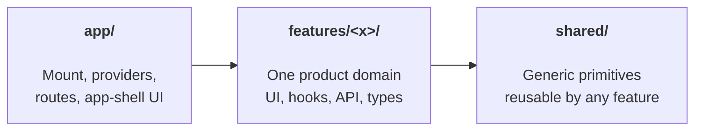
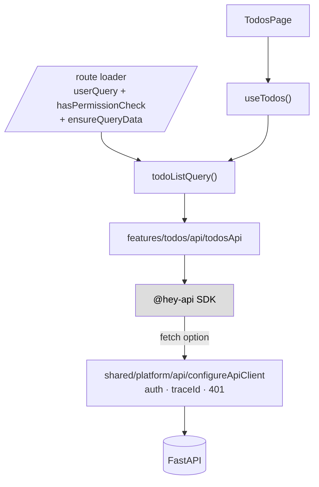
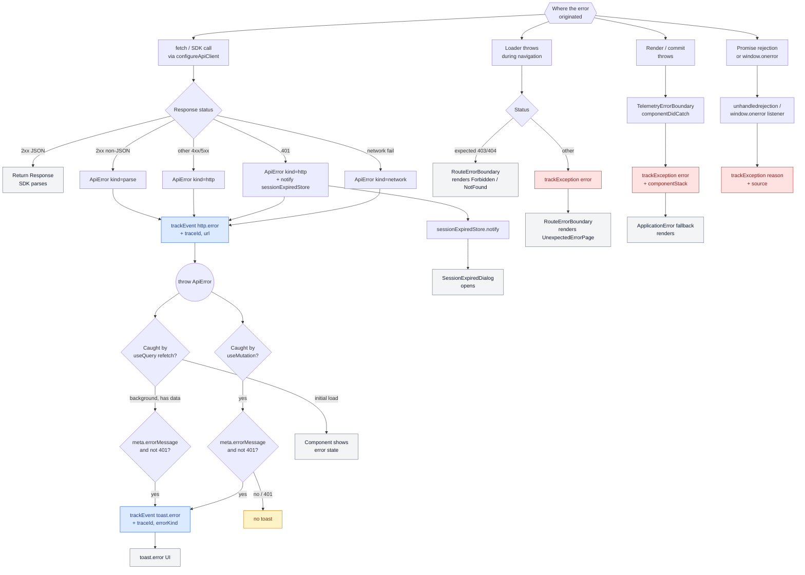

# Extending the Web

Find what you need:

- **New here?** → [The 30-second tour](#the-30-second-tour)
- **Where does my new code go?** → [Quick lookup](#quick-lookup) or [the decision tree](#decision-tree)
- **Adding a feature / route / query / mutation / form?** → [Recipes](#recipes)
- **What's the file-naming convention?** → [Naming](#naming)
- **What state container should I use?** → [State — pick the lowest tier](#state-pick-the-lowest-tier)
- **What gets logged to App Insights?** → [Telemetry](#telemetry)
- **My code feels off, is it an anti-pattern?** → [Anti-patterns](#anti-patterns)
- **Where do env vars live?** → [Configuration](#configuration)

---

## The 30-second tour

The web is grouped by features. Three top-level boundaries with a strict dependency direction: **`app/` → `features/` → `shared/`**. Features never reach into each other.



```
src/
├── index.tsx            # ReactDOM.createRoot — mount + bootstrap order
├── app/                 # composition root
│   ├── bootstrap/       # Providers, createQueryClient, ApplicationError
│   ├── routes/          # TanStack Router file-based routes (+ routeTree.gen.ts)
│   ├── layout/          # RootLayout, Header, VersionText (per-component folders)
│   ├── error-pages/     # RouteErrorBoundary, 403/404/UnexpectedError pages
│   ├── auth/            # SessionExpiredDialog
│   └── styles/          # Tailwind + EDS overrides
├── features/            # product domains — one folder each
│   └── todos/           # api/, pages/, index.ts (public surface)
├── shared/              # platform/, components/, utils/, types/
├── api-generated/       # @hey-api output — never edited by hand
└── config/              # env validation, feature flags, access control
```

**Two rules cover most decisions:**

1. **One consumer → keep it in the feature. Second consumer → promote to `shared/`.**
2. **App-shell (one per app) → `app/`. Domain → `features/<x>/`. Generic primitive → `shared/`.**

---

## Quick lookup

| I want to add… | Put it in | Notes |
|---|---|---|
| A **route** | `app/routes/<name>.tsx` (file-based; auto-registered into `routeTree.gen.ts`) | `createFileRoute(...)` with `beforeLoad` (auth + permission gate) and `loader` (`ensureQueryData`). The root route in [`app/routes/__root.tsx`](https://github.com/equinor/template-fastapi-react/blob/main/web/src/app/routes/__root.tsx) attaches `errorComponent` and `notFoundComponent` once for the whole tree. |
| A **page** for a feature | `features/<x>/pages/<X>Page/<X>Page.tsx` | Composition only — no `useState`, no `fetch`. Co-locate `<X>Page.hooks.ts`, `<X>Page.utils.ts`, tests, and a `components/` subfolder. |
| A **component** used by one feature | `features/<x>/pages/<X>Page/components/<C>/` (or `features/<x>/components/<C>/` if shared across pages) | Pure UI leaf. Per-component folder — see [Naming](#naming). |
| A **component** used by ≥2 features | `shared/components/<C>/` | Promote on the *second* consumer, not the first. |
| An **API call** | `features/<x>/api/<x>Api.ts` | The **only** file allowed to import `@/api-generated`. |
| A **query hook** | `features/<x>/api/queries/<resource>Query.ts` (factory) + `use<Resource>.ts` (hook) | Loader and component spread the **same** factory. |
| A **mutation hook** | `features/<x>/api/mutations/use<Action>.ts` | Branch on `isError` in the component, not in `onSuccess`. |
| A **type from the API** | `features/<x>/api/schema.ts` | One zod schema → types, validation, form resolver. |
| A **cross-feature type** | `shared/types/` | API types stay in `features/<x>/api/`. |
| A **form** | Inside the feature, with `react-hook-form` + the zod schema from `api/schema.ts` | Branch on `mutation.isError` inline; never `try/catch` `mutateAsync`. |
| A **utility** | `features/<x>/utils.ts` (one consumer) → `shared/utils/` (second) | Pure. No React, no `fetch`. |
| A **hook** | Same rule as utility, with `use` prefix | Touches React. |
| A **provider** | [`app/bootstrap/Providers.tsx`](https://github.com/equinor/template-fastapi-react/blob/main/web/src/app/bootstrap/Providers.tsx) | Telemetry → error boundary → query → toasts → session-expired dialog. |
| A **3rd-party SDK** (App Insights, posthog, MSAL…) | `shared/platform/<area>/` | The **only** place SDKs are imported. Components import the wrapper. |
| An **env variable** | [`web/src/config/env.ts`](https://github.com/equinor/template-fastapi-react/blob/main/web/src/config/env.ts) | zod-parsed. Import `ENV`; never read `import.meta.env` directly. |
| A **custom telemetry event** from a component | `useTrackEvent('name', baseProps?)` from `@/shared/platform/telemetry` | Returns a stable callback. See [Telemetry](#telemetry). |

### Decision tree

If the table doesn't fit, walk the questions:


### State — pick the lowest tier

| Data | Use |
|---|---|
| Server data | TanStack Query — never Context, Redux, or Zustand |
| Route / filters / page | URL via [`nuqs`](https://nuqs.47ng.com/), route params, loaders |
| Form draft | [`react-hook-form`](https://react-hook-form.com/) |
| One component | `useState` |
| Siblings | Lift to parent |
| Global, low frequency | Context (theme, current user) |
| Global, high frequency | [Zustand](https://zustand-demo.pmnd.rs/) / [Jotai](https://jotai.org/) — Context re-renders every consumer |
| Derived | Compute during render — never store |

---

## Recipes

Concrete starting points. Reference implementation: [`web/src/features/todos/`](https://github.com/equinor/template-fastapi-react/tree/main/web/src/features/todos).

### Add a feature from scratch

1. `mkdir -p web/src/features/<x>/{api/queries,api/mutations,pages/<X>Page/components}`
2. Create the files below. Each has exactly **one** instance per resource:

    ```
    features/<x>/
    ├── api/
    │   ├── <x>Api.ts                       # only file importing @/api-generated
    │   ├── schema.ts                       # zod → types, validation, form resolver
    │   ├── keys.ts                         # aliases generator keys (getAllXQueryKey, …)
    │   ├── queries/                        # queryOptions factory + use<Resource> hooks
    │   ├── mutations/                      # use<Action> hooks
    │   └── invalidations.ts                # only when ≥2 mutations
    ├── pages/
    │   └── <X>Page/
    │       ├── <X>Page.tsx                 # composition only
    │       ├── <X>Page.hooks.ts            # page-level hooks (URL state, etc.)
    │       ├── <X>Page.utils.ts            # pure helpers
    │       ├── <X>Page.test.tsx            # integration test
    │       └── components/                 # UI leaves used only by this page
    │           └── <C>/<C>.tsx             # per-component folders
    └── index.ts                            # public surface: page, factory, shared type
    ```

    Components shared across **multiple pages** of the same feature live in `features/<x>/components/`. Promote to `shared/components/` only on the **second feature** consumer.

3. Export only the **public surface** from `index.ts`: page component, `queryOptions()` factory, shared type. Keep hooks/keys/api wrapper internal.
4. Add a route file in [`app/routes/`](https://github.com/equinor/template-fastapi-react/tree/main/web/src/app/routes) — see [Add a route](#add-a-route). The error/404 surfaces are attached once on the root route in [`__root.tsx`](https://github.com/equinor/template-fastapi-react/blob/main/web/src/app/routes/__root.tsx).

**Self-test:** delete `features/<x>/` — the rest of the app must still build. If it doesn't, something leaked.

### Add a query

1. In `features/<x>/api/queries/<resource>Query.ts`, write a `queryOptions()` factory. Reuse the generator's key from `keys.ts`.
2. In the same folder, write `use<Resource>.ts` that spreads the factory.
3. In the route file, the loader spreads the **same** factory: `loader: ({ context: { queryClient } }) => queryClient.ensureQueryData(<resource>Query())`.

### Add a mutation

1. In `features/<x>/api/mutations/use<Action>.ts`, wrap `useMutation` and call `<x>Api.<action>()`.
2. Either inline `onSuccess: qc.invalidateQueries({ queryKey: <resource>Keys.list() })`, or — once you have ≥2 mutations — centralise in `api/invalidations.ts` and call `invalidateAll(qc, todoInvalidations.onCreate())`.
3. In the component, branch on `mutation.isError` inline. **Don't** `try/catch` `mutateAsync`. **Don't** add a global toast for the first mutation.

### Add a form

1. Reuse the zod schema from `api/schema.ts` as the `react-hook-form` resolver.
2. Don't disable submit on `!isValid` — let RHF show validation on submit.
3. On submit, call the mutation hook. Render the error inline next to the failing control.

### Add a route

Routes are **file-based** via the TanStack Router Vite plugin. Drop a file in [`app/routes/`](https://github.com/equinor/template-fastapi-react/tree/main/web/src/app/routes); the plugin regenerates `routeTree.gen.ts` and code-splits the chunk for you.

1. Create `app/routes/<name>.tsx` exporting `Route = createFileRoute('/<name>')({ ... })`.
2. Compose the lifecycle in this order:
    - `beforeLoad`: `await queryClient.ensureQueryData(userQuery())`, then call `hasPermissionCheck(user, '<resource>', '<action>')`. Failed checks `throw new Response(null, { status: 403 })`. Return `{ user }` so children/loader can read it from context.
    - `loader`: `await queryClient.ensureQueryData(<resource>Query())` to prime the cache so the page paints with data on first render.
3. Set `component: <X>Page` (imported from the feature's `index.ts`).
4. **Don't** attach `errorComponent` per-route — the root route already does, mapping 401/403/404/500 to the right page. See [`__root.tsx`](https://github.com/equinor/template-fastapi-react/blob/main/web/src/app/routes/__root.tsx) and [Error & telemetry flow](#error--telemetry-flow).

---

## Naming

Components live in **per-component folders**. The folder name matches the component; sibling files use dotted suffixes for kind. Files are added only when there is real content for them — empty stubs are not created.

```
<C>/
├── <C>.tsx          # the component
├── <C>.types.ts     # exported props/types (when there's more than a 1-line inline type)
├── <C>.utils.ts     # pure helpers / constants used by the component
├── <C>.styles.tsx   # styled JSX (only if not pure Tailwind/utility classes)
└── <C>.test.tsx     # colocated tests
```

Files inside `app/bootstrap/`, `app/routes/`, `features/<x>/api/`, and `shared/utils/` stay flat — the per-component folder rule is for components.

| Thing | Pattern | Example |
|---|---|---|
| Component folder | `PascalCase/` | `TodoList/` |
| Component file | `<Folder>.tsx` | `TodoList/TodoList.tsx` |
| Component types | `<Folder>.types.ts` | `TodoList/TodoList.types.ts` |
| Component utils | `<Folder>.utils.ts` | `TodoList/TodoList.utils.ts` |
| Test | `<Folder>.test.tsx` | `TodoList/TodoList.test.tsx` |
| Hook | `use<Name>.ts` | `useTodos.ts` |
| Module | `camelCase.ts` | `todosApi.ts` |
| `queryOptions` factory | `<resource>Query.ts` | `todoListQuery.ts` |
| Page | `<X>Page/<X>Page.tsx` (+ `.hooks.ts`, `.utils.ts`, `.test.tsx`) | `TodosPage/TodosPage.tsx` |
| Route file | `<name>.tsx` (file-based) | `app/routes/index.tsx` |

---

## Reference

### Request flow

What happens when a user navigates to `/todos`:



On failure: the HTTP funnel tags the error with `traceId`, `telemetry.trackEvent('http.error', …)` records, and the route's `errorComponent` (`RouteErrorBoundary`) renders `UnexpectedErrorPage` showing the traceId.

### Telemetry

App Insights is wrapped by an abstract `Telemetry` interface ([`shared/platform/telemetry/types.ts`](https://github.com/equinor/template-fastapi-react/blob/main/web/src/shared/platform/telemetry/types.ts)) so the same code runs against `console`, `noop` (tests), or the App Insights backend selected via `ENV.telemetryBackend`.

```ts
type Telemetry = {
  trackEvent: (name: string, props?: Record<string, unknown>) => void
  trackException: (err: unknown, ctx?: Record<string, unknown>) => void
  setUser: (id: string | null) => void
}
```

#### What gets logged

| Channel | Where it's logged | What's captured | App Insights table |
|---|---|---|---|
| **Page views** (auto) | App Insights SDK via `enableAutoRouteTracking: true` + initial `trackPageView()` on boot | URL, route, referrer, duration | `pageViews` |
| **Page visit time** (auto) | SDK via `autoTrackPageVisitTime: true` | Time the user was on a page before navigating away | `pageViews.customMeasurements.PageVisitTime` |
| **Outbound fetch / XHR** (auto) | SDK via `disableFetchTracking: false` + `enableCorsCorrelation` + `enableRequestHeaderTracking`/`enableResponseHeaderTracking` | URL, method, status, duration, request/response headers, correlation ID | `dependencies` |
| `http.error` | [`shared/platform/api/configureApiClient.ts`](https://github.com/equinor/template-fastapi-react/blob/main/web/src/shared/platform/api/configureApiClient.ts) — every non-2xx, network failure, timeout, abort, or non-JSON 2xx | `kind` (`network` / `http` / `parse`), `traceId`, `status?`, `url`, `reason?` (`timeout` / `abort`) | `customEvents` |
| `toast.error` | [`app/bootstrap/createQueryClient.ts`](https://github.com/equinor/template-fastapi-react/blob/main/web/src/app/bootstrap/createQueryClient.ts) `MutationCache` / `QueryCache` `onError` | `kind` (`mutation` / `query`), `template` (toast text), `traceId`, `errorKind`, `status?`. 401s and queries without cached data are skipped | `customEvents` |
| Custom events | Any component via `useTrackEvent('event.name', baseProps?)` from `@/shared/platform/telemetry` | Caller-supplied props (merged with `baseProps`) | `customEvents` |
| Mount events | Any component via `useTrackMount('view.opened', props?)` | Fires once on mount | `customEvents` |
| **Route load / render exceptions** | [`app/error-pages/RouteErrorBoundary/RouteErrorBoundary.tsx`](https://github.com/equinor/template-fastapi-react/blob/main/web/src/app/error-pages/RouteErrorBoundary/RouteErrorBoundary.tsx) | The thrown error. **Skips** expected client errors (401/403/404). StrictMode-deduped via ref. | `exceptions` |
| **Provider-stack exceptions** | [`shared/platform/telemetry/TelemetryErrorBoundary.tsx`](https://github.com/equinor/template-fastapi-react/blob/main/web/src/shared/platform/telemetry/TelemetryErrorBoundary.tsx) | `error`, `componentStack`. Last-resort React boundary inside `Providers`; renders `<ApplicationError />`. | `exceptions` |
| **Global exceptions** | [`shared/platform/telemetry/registerGlobalErrorHandlers.ts`](https://github.com/equinor/template-fastapi-react/blob/main/web/src/shared/platform/telemetry/registerGlobalErrorHandlers.ts) — `window.onerror` and `unhandledrejection` | `error`/`reason`, `source` (`window.onerror` / `unhandledrejection`) | `exceptions` |
| **User identity** | Root route `beforeLoad` calls `telemetry.setUser(user.id)` after `userQuery` resolves; [`shared/platform/auth/redirects.ts`](https://github.com/equinor/template-fastapi-react/blob/main/web/src/shared/platform/auth/redirects.ts) `signOut` calls `setUser(null)` | Authenticated user id (no PII) | tags subsequent rows: `user_AuthenticatedId` |

Two telemetry shapes are used deliberately:

| Method | When | Severity in App Insights |
|---|---|---|
| `trackEvent('http.error', …)` and `'toast.error'` | Operational signal — every HTTP failure, every user-facing toast | low (`customEvents`) |
| `trackException(error, ctx)` | Real exceptions — uncaught render errors, unexpected route errors, escaped promise rejections | high (`exceptions`) |

The split exists so a single user-visible failure produces **exactly one exception** in App Insights. The HTTP layer emits a low-noise event (correlate by `traceId`); the exception is reserved for the boundary that actually surfaces the failure to the user.

#### 401 has its own path

`configureApiClient` detects 401 → calls `sessionExpiredStore.notify()` (a module-level latched store, not a transient DOM event — so loader-time 401s aren't lost before React mounts) → `SessionExpiredDialog` reads the latch via `useSyncExternalStore` and opens. The dialog's "Sign in" button opens the BFF in a popup tab; the popup lands on `/auth-success`, posts an origin-checked message back to `window.opener`, and the dialog refetches `userQuery`, calls `sessionExpiredStore.clear()`, and dismisses — leaving page state, scroll position, and in-flight uploads intact. Popup-blocker fallback redirects the same tab. Toast and route boundary both suppress 401 to avoid double-surfacing. The `http.error` event still fires (with `status=401`), but no exception.



Reading the chart: blue = `customEvents` (cheap, high-volume); red = `exceptions` (the things that page on-call); yellow = explicitly skipped to avoid double-surfacing; grey = user-visible UI outcome.

**Design rules in evidence:**

1. **One exception per user-visible failure.** HTTP errors emit events, not exceptions. The exception fires only at the boundary that actually shows the user an error page.
2. **`traceId` is the join key.** Every `http.error` event carries the same `traceId` you'll see in the inline `<ErrorPanel>` UI and in any `toast.error` follow-up. KQL across them works without correlation IDs from the SDK.
3. **401 never escalates.** It opens the session dialog, emits a low-noise event, and is suppressed in toasts and the route boundary.
4. **Expected 4xx (403/404 from loaders) are not exceptions.** They're navigation outcomes; they render a dedicated page and skip telemetry.
5. **StrictMode dedup.** `RouteErrorBoundary` ref-compares the error so React's dev double-effect doesn't double-report.

#### KQL for debugging a user-reported `traceId`

```kusto
union customEvents, exceptions, dependencies
| where customDimensions.traceId == "<paste>"
| order by timestamp asc
```

Top failing endpoints in the last hour:

```kusto
customEvents
| where name == "http.error" and timestamp > ago(1h)
| summarize count() by tostring(customDimensions.url), tostring(customDimensions.status)
| order by count_ desc
```

### `app/` — what each file does

App-shell UI lives here, **not** in `shared/components/` (`RootLayout`, `RouteErrorBoundary`, `NotFoundPage`, `SessionExpiredDialog` — one of each per app). A landing **route** belongs in `features/home/`.

| File | Role |
|---|---|
| [`src/index.tsx`](https://github.com/equinor/template-fastapi-react/blob/main/web/src/index.tsx) | Mount root. In order: `createTelemetry(ENV.telemetryBackend)` → `configureApiClient({ telemetry })` (wires the generated SDK through the HTTP funnel) → `createQueryClient({ telemetry })` → `startSessionWatcher(queryClient)` → `registerGlobalErrorHandlers(telemetry)` → `createRouter` → `createRoot().render(<Providers><RouterProvider/></Providers>)`. Bootstrap try/catch renders `<ApplicationError />` if any of the above throws. |
| [`app/bootstrap/Providers.tsx`](https://github.com/equinor/template-fastapi-react/blob/main/web/src/app/bootstrap/Providers.tsx) | Provider stack: `TelemetryProvider` → `TelemetryErrorBoundary` (fallback `<ApplicationError />`) → `QueryClientProvider` → `<SessionExpiredDialog />` (sibling, subscribes to `sessionExpiredStore` via `useSyncExternalStore`) → `children` → `<ToastContainer />` → `<ReactQueryDevtools />` (DEV only). |
| [`app/bootstrap/createQueryClient.ts`](https://github.com/equinor/template-fastapi-react/blob/main/web/src/app/bootstrap/createQueryClient.ts) | Wraps `createBaseQueryClient` from `shared/platform/api` with a toast-backed notifier and a 401-suppression rule. Emits `toast.error` telemetry events alongside the toast. |
| [`app/bootstrap/ApplicationError.tsx`](https://github.com/equinor/template-fastapi-react/blob/main/web/src/app/bootstrap/ApplicationError.tsx) | Outermost fallback rendered by `TelemetryErrorBoundary` and the bootstrap try/catch. Tailwind utilities only (no router, no theme tokens) so it renders even when the provider stack failed. |
| [`app/routes/__root.tsx`](https://github.com/equinor/template-fastapi-react/blob/main/web/src/app/routes/__root.tsx) | Root route. `beforeLoad` resolves `userQuery` and calls `telemetry.setUser(user.id)`. Attaches `component: RootLayout`, `errorComponent: RouteErrorBoundary`, `notFoundComponent: NotFoundPage` once for the whole tree. |
| [`app/routes/index.tsx`](https://github.com/equinor/template-fastapi-react/blob/main/web/src/app/routes/index.tsx), `app/routes/<name>.tsx` | Per-route file. `validateSearch` (zod), `beforeLoad` (auth + permission), `loader` (`ensureQueryData`), `component`. File-based routing — the TanStack Router Vite plugin regenerates `routeTree.gen.ts` and code-splits each route. |
| [`app/routes/auth-success.tsx`](https://github.com/equinor/template-fastapi-react/blob/main/web/src/app/routes/auth-success.tsx) | `/auth-success` — landing target inside the re-auth popup tab. No loader, no chrome — calls `useAuthSuccessHandshake()` and shows a fullscreen `<LoadingState>`. |
| [`app/error-pages/RouteErrorBoundary/RouteErrorBoundary.tsx`](https://github.com/equinor/template-fastapi-react/blob/main/web/src/app/error-pages/RouteErrorBoundary/RouteErrorBoundary.tsx) | Maps loader/render failures to UX: 401 returns `null` (the dialog is the UX), 403 → `<ForbiddenPage />`, 404 → `<NotFoundPage />`, everything else → `<UnexpectedErrorPage />` with `traceId`. Reports unexpected errors via `trackException` (StrictMode-deduped). |
| [`app/layout/RootLayout/RootLayout.tsx`](https://github.com/equinor/template-fastapi-react/blob/main/web/src/app/layout/RootLayout/RootLayout.tsx) | App shell — `Header`, `<Suspense>`, `<Outlet />`, wrapped in `FeatureFlagsProvider`. |
| [`app/auth/SessionExpiredDialog/SessionExpiredDialog.tsx`](https://github.com/equinor/template-fastapi-react/blob/main/web/src/app/auth/SessionExpiredDialog/SessionExpiredDialog.tsx) | Modal mounted in `Providers`. Reads `sessionExpiredStore`, drives the popup re-auth flow via `useReauthFlow`. |

**Auth in loaders** — the server is the security boundary; the frontend just hides what users can't do. Loaders compose `ensureQueryData(userQuery())` to resolve identity, then a single `hasPermissionCheck(user, '<resource>', '<action>')` from [`@/config/accessControl`](https://github.com/equinor/template-fastapi-react/blob/main/web/src/config/accessControl.ts) — never `user.role === 'admin'` in components. Failed checks `throw new Response(null, { status: 403 })`, which `RouteErrorBoundary` maps to `<ForbiddenPage />` in place.

### `shared/` — what each folder is for

Generic primitives every feature can use. **Features depend on `shared/`; `shared/` never depends on a feature.**

| Folder | Contents | Promotion rule |
|---|---|---|
| `platform/` | `api/` ([`configureApiClient`](https://github.com/equinor/template-fastapi-react/blob/main/web/src/shared/platform/api/configureApiClient.ts), `ApiError`, `createBaseQueryClient`, `sessionExpiredStore`), `telemetry/`, `auth/`, `feature-flags/` | The **only** place 3rd-party SDKs and the network are touched. Single funnel for outbound HTTP — auth, traceId, 401 → `sessionExpiredStore.notify()`, error normalisation. **If you'd add `try/catch` in a query hook, the catch belongs in `api/` instead.** |
| `components/`, `hooks/` | `Button`, `useDebounce`, … | Promote on the **second** consumer. |
| `utils/` | `date`, `money`, `sanitize` | Pure. No React, no `fetch`. |
| `theme/`, `types/`, `i18n/` | Tokens, cross-feature types/strings | Feature-local versions stay in `features/<x>/`. |

`traceId` surfaces on every error page — one paste, one log search, root cause. Don't log PII, tokens, or full bodies.

!!! note "Why a custom `queryOptions()` factory and not `<resource>Options()` from the generator?"
    Use the generator's options directly only if your cache stores raw DTOs. If you normalize (e.g. `is_done` → `done`), write your own factory and reuse `getAllTodosQueryKey()` in `keys.ts` so the *key* still aligns with the generator.

---

## Anti-patterns

If something feels wrong, scan here first.

### Boundaries

| Smell | Why it hurts | Fix |
|---|---|---|
| Component calls `fetch` / generated client directly | Skips wrapper, normaliser, traceId, error normalisation. | Add a hook in `features/<x>/api/queries/`. |
| Cross-feature import past `index.ts` | Breaks public-surface contract. | Import from feature `index.ts`, or push the shared bit into `shared/`. |
| Helper added to `shared/` "just in case" | Junk drawer. | Keep in feature until a *second* caller. |
| Sentry/posthog SDK imported from a component | Telemetry bleeds; can't swap or disable in tests. | Import from `shared/platform/telemetry/` only. |
| New top-level folder (`helpers/`, `common/`, `core/`) | Bypasses the three-layer model; becomes a graveyard. | Pick `shared/utils/` or a feature folder. |
| `index.ts` exports `todoKeys` and `todosApi` | Cross-feature callers can construct keys themselves; the contract leaks. | Export the `queryOptions` factory; keep keys/api internal. |
| Intra-feature import via the feature's own `index.ts` | Circular import waiting to bite. | Use relative paths inside the feature. |

### State

| Smell | Why it hurts | Fix |
|---|---|---|
| Server data in Context or Zustand | Two caches now disagree. | TanStack Query *is* the cache. |
| Filter / page / sort in `useState` | Refresh loses it; can't share a link. | Move to URL via `nuqs`. |
| `useEffect` that fetches and `setState`s | Reinvents TanStack Query badly: no cache, no dedupe, no retry. | Replace with a query hook. |
| Business rule in `useEffect` | Runs on render path, fires twice in StrictMode, hides intent. | Derive during render, or move to event handler / `onSuccess`. |
| Inline `{queryKey, queryFn}` in a hook *and* in a loader | Two call sites drift; loader prefetches a different cache slot than the hook subscribes to. | Extract a `queryOptions()` factory; both sites spread it. |
| Inline `qc.invalidateQueries(...)` in every `onSuccess` | Invalidation graph spread across N files; easy to miss one when adding a mutation. | Centralize in `invalidations.ts`. |
| Backend DTO leaks into a prop (`is_done: boolean`) | UI depends on snake_case + nullables you didn't choose. | Normalise in wrapper; props use app shape. |
| Non-trivial computation inline in JSX | Re-derived on every render path; can't unit-test without RTL; intent hidden in markup. | Extract a pure helper in the feature. |

### Errors

| Smell | Why it hurts | Fix |
|---|---|---|
| `try/catch` around query that just `console.error`s | Swallows error; boundary never fires; user sees stale UI. | Let it throw; handle at `RouteErrorBoundary`. Use `onError` only for rollback. |
| `try/catch` around `mutateAsync` to display an error | Hides what React Query already exposes. | Branch on `mutation.isError` in the rendering component. |
| Toast system added "for mutation errors" before any second consumer | Premature `shared/` primitive; obscures *where* the failure happened. | Inline alert next to the failing control. Add a toast only when ≥2 features need it. |
| Per-route `errorComponent` override | Bypasses the root mapping (Forbidden / NotFound / Unexpected). | Let `__root.tsx` handle it. Throw `Response(null, { status: 403/404 })` from `beforeLoad`. |
| `any` / `as unknown as T` near API boundary | Hides where validation belongs. | Parse with zod at the wrapper edge. |

### Hygiene

| Smell | Why it hurts | Fix |
|---|---|---|
| `dangerouslySetInnerHTML` with backend HTML | XSS by default. | Sanitise via `shared/utils/sanitize` (DOMPurify), or render as text. |
| Test imports `_privateThing` from a feature | Test blocks every refactor. | Test through public surface, or extract a pure helper. |
| `Container.tsx` + `View.tsx` for one component | Two components in the tree, props plumbed twice. | Extract a component hook instead. |

---

## Configuration

Runtime config funnels through one typed module — [`web/src/config/env.ts`](https://github.com/equinor/template-fastapi-react/blob/main/web/src/config/env.ts). Import `ENV` from there; never read `import.meta.env` directly.

See [configuration](../../../../about/running/02-configure.md) for the full list of environment variables.
