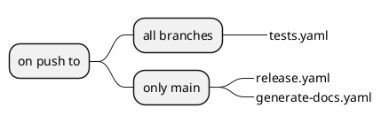

# Publishing

## Github actions

We use [GitHub Actions](https://docs.github.com/en/actions), as the [CI/CD pipeline](https://github.com/equinor/template-fastapi-react/actions).

GitHub Actions make it easy to automate all our software workflows. They build, test, and deploy the code right from GitHub.

All the heavy lifting is done by GitHub. GitHub will simply use the files defined in [`.github/workflows`](https://github.com/equinor/template-fastapi-react/tree/main/.github/workflows) to do the setup.

We trigger the reusable workflow like this:



Since we are using trunk based development, all pushes to main trigger a release to a test environment.

Release to production is triggered when we merge in the auto-generated pull requests (that contains changelogs) that are created by the `release-please.yml` Github action. 

### Workflows

<details>

<summary>Overview</summary>

Reusable workflows

| Workflow                                                                                                                                 | Job                        | Purpose                                                                          |
|------------------------------------------------------------------------------------------------------------------------------------------|----------------------------|----------------------------------------------------------------------------------|
| [tests.yaml](https://github.com/equinor/template-fastapi-react/blob/main/.github/workflows/tests.yaml)                                   | pre-commit                 | Runs the pre-commit hooks. See [Hooks](01-setup.md#hooks) for details                                     |
|                                                                                                                                          | test-api                   | Runs tests on the API (backend) using pytest and behave                          |
|                                                                                                                                          | test-web                   | Runs tests on the Web (frontend)                                                 |
| [generate-changelog.yaml](https://github.com/equinor/template-fastapi-react/blob/main/.github/workflows/generate-changelog.yaml)         | generate-changelog         | Automatically generates changelogs based on commit messages                      |
| [publish.yaml](https://github.com/equinor/template-fastapi-react/blob/main/.github/workflows/publish.yaml)                               | build-and-publish-web-main | Builds and publishes the Docker image for the Web (frontend)                     |
|                                                                                                                                          | build-and-publish-api-main | Builds and publishes the Docker image for the API (backend)                      |
|                                                                                                                                          | build-and-publish-nginx    | Builds and publishes the Docker image for the Nginx proxy                        |
| [deploy.yaml](https://github.com/equinor/template-fastapi-react/blob/main/.github/workflows/deploy.yaml)                                 | deploy-on-radix            | Deploys the services to Radix                                                    |
|                                                                                                                                          |                            |                                                                                  |
| [release-production.yaml](https://github.com/equinor/template-fastapi-react/blob/main/.github/workflows/release-production.yaml)         | tests                      | Uses the `tests` workflow                                                        |
|                                                                                                                                          | publish-production         | Uses the `publish` workflow to create a release for the `production` environment |
|                                                                                                                                          | deploy-prod                | Uses the `deploy` workflow to deploy to the `production` environment             |
| [publish-docs.yaml](https://github.com/equinor/template-fastapi-react/blob/main/.github/workflows/publish-docs.yaml)                     | publish-docs               | Builds and publishes the latest docs to GitHub pages                             |

Triggerable workflows

| Workflow                                                                                                                                 | Job                        | Purpose                                                                          |
|------------------------------------------------------------------------------------------------------------------------------------------|----------------------------|----------------------------------------------------------------------------------|
| [on-push-feature-branch.yaml](https://github.com/equinor/template-fastapi-react/blob/main/.github/workflows/on-push-feature-branch.yaml) | tests                      | Uses the `tests` workflow                                                        |
| [on-push-main-branch.yaml](https://github.com/equinor/template-fastapi-react/blob/main/.github/workflows/on-push-main-branch.yaml)       | tests                      | Uses the `tests` workflow                                                        |
|                                                                                                                                          | generate-changelog         | Uses the `generate-changelog` workflow                                           |
|                                                                                                                                          | docs                       | Uses the `publish-docs` workflow                                                 |
|                                                                                                                                          | publish-latest             | Uses the `publish` workflow to create a release for the `test` environment       |
|                                                                                                                                          | deploy-test                | Uses the `deploy` workflow to deploy to the `test` environment                   |
| [codeql.yaml](https://github.com/equinor/template-fastapi-react/blob/main/.github/workflows/codeql.yml)                                  | analyze                    | Runs `CodeQL` on the source code                                                 |
| [release-please.yaml](https://github.com/equinor/template-fastapi-react/blob/main/.github/workflows/release-please.yml)                  | release-please             | Creates a new release on GitHub                                                  |
|                                                                                                                                          | deploy-prod                | Uses the `release-production` workflow to create a new production release        |

</details>

#### Reusable workflows

A reusable workflow is just like any GitHub Actions workflow with one key difference - it includes a `workflow_call` trigger.

* The [`release-please.yaml`](https://github.com/equinor/template-fastapi-react/blob/main/.github/workflows/release-please.yml) workflow will automatically create a pull request with an auto-generated changelog everytime code is pushed to the main branch. It also bumps the version code (using semantic versioning, depending on the types of commits) and create a tagged release that can be used to deploy to production.

* The [`tests.yaml`](https://github.com/equinor/template-fastapi-react/blob/main/.github/workflows/tests.yml) workflow will automatically run all types of tests.

* The [`publish-docs.yaml`](https://github.com/equinor/template-fastapi-react/blob/main/.github/workflows/publish-docs.yml) workflow will build the documentation. Then it will deploy the documentation (placed in the site folder) to GitHub Pages.

## Changelogs

We auto-generate changelogs by following the [conventional commits](https://www.conventionalcommits.org/en/v1.0.0/) specification.

### How to generate

#### Auto-generated

The Github action `release-please.yaml` is a workflow that will automatically create a pull request with an auto-generated changelog everytime code is pushed to the main branch.

#### Locally

Sometimes it is nice to generate the changelogs locally for testing.

It is possible to use [act](https://github.com/nektos/act) to run Github actions locally.

```shell
act -j release-please -s GITHUB_TOKEN=<GITHUB_TOKEN>
````

`GITHUB_TOKEN`: Log in to GitHub and generate a personal access token (PaT) from `Personal settings -> Developer settings -> Personal access tokens`.