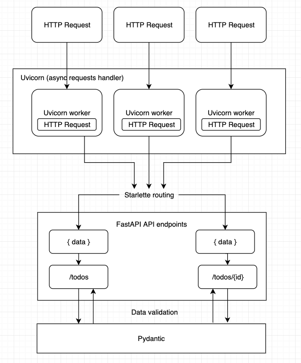

# Extending the API

## FastAPI

[FastAPI](https://github.com/tiangolo/fastapi) is a high-performant REST API framework for Python. It's built on top of [Starlette](https://github.com/encode/starlette), an ASGI (Asynchronous Server Gateway Interface) implementation for Python, and it uses [Pydantic](https://github.com/pydantic/pydantic) for data validation. It can generate [OpenAPI](https://swagger.io/docs/specification/about/) documentation from your code and also produces a [Swagger UI](https://swagger.io/tools/swagger-ui/) that you can use to test your application. OpenAPI uses a subset of [JSON Schema](https://json-schema.org/) to describe APIs and define the validation rules of the
API payloads and parameters.

To run FastAPI applications, we use the process manager [uvicorn](https://github.com/encode/uvicorn). Check out the official [documentation](https://fastapi.tiangolo.com/deployment/server-workers/) for more details.



## Codebase structure

The API is grouped by features.


The API has a feature-based folder structure following the principles of [Clean Architecture](../01-architecture.md). 

```
├── api/
│   └── src/
│       ├── common/
│       ├── entities/ 
│       ├── features/ 
│       │   ├── health_check/
│       │   ├── todo/
│       │   ├── whoami/
│       │   └── ...
│       ├── data_providers/
│       └── tests/
│           ├── unit/
│           └── integration/       
└── ...
```

- `common` contains shared code like authentication, exceptions, response decorator
- [`entities`](02-adding-entities.md) contains all entities, enums, exceptions, interfaces, types and logic specific to the domain layer
- [`features`](adding-features) contains use-cases (application logic), repository interfaces, and controllers
- [`data providers`](adding-data-providers) contains classes for accessing external resources such as databases, file systems, web services, and repository implementations
- `tests` contains unit and integrations tests 

## Get started 

1. Create the domain model by [adding entities](02-adding-entities.md)
2. Extend the API by [adding features](adding-features)
   * Add a [use case](adding-features/02-use-cases.md) to handle application logic 
   * Add a [controller](adding-features/01-controllers.md) to handle API requests
      * Add an endpoint to the controller that executes the use case
3. Add a data provider, [repository interface](adding-data-providers/02-repository-interfaces.md) and [repository](adding-data-providers/03-repositories.md) to handle communication to external services such as databases.


:::note

Entities and data providers can be shared between features (the entrypoints and use-cases).

:::


## Configuration

All configuration parameters are expected to be environment variables, and are defined in this file `api/src/config.py`.

```mdx-code-block
import CodeBlock from '@theme/CodeBlock';
import auth from '!!raw-loader!@site/../api/src/config.py';

<CodeBlock language="jsx">{auth}</CodeBlock>
```

See [configuration](../../../../about/running/configure) for a description of the different configuration options available.