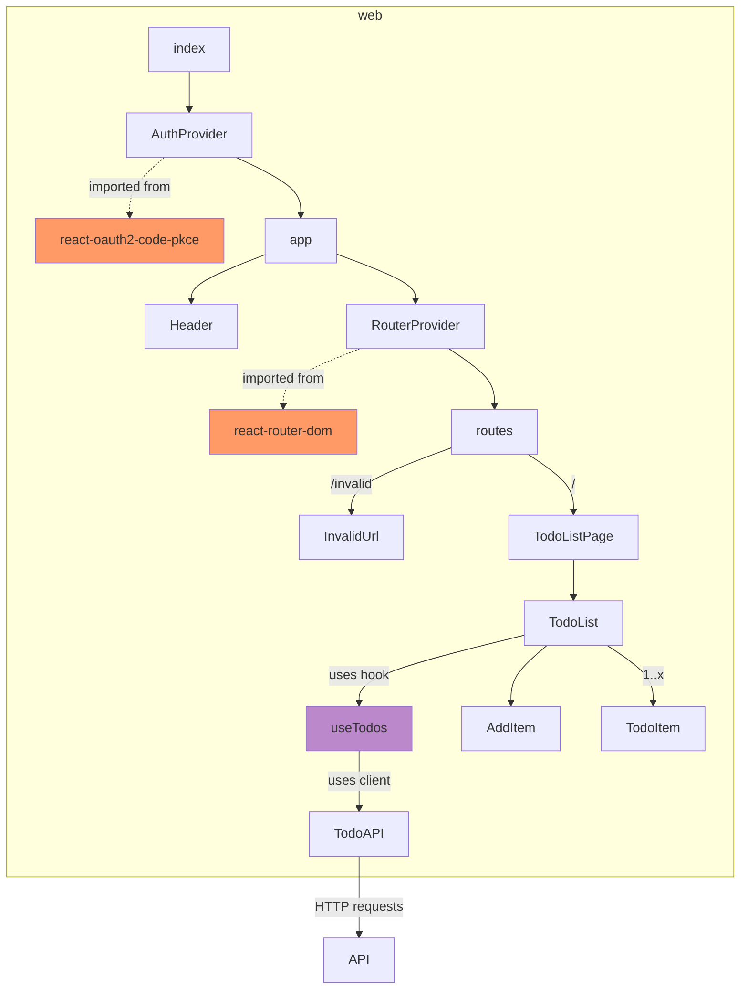

# Extending the web

The web is grouped by features.

## Codebase structure

The web has a feature-based folder structure. 

```
├── web/
│   └── src/
│       ├── api/
│       ├── common/
│       ├── features/ 
│       │   ├── todos/
│       │   └── ...
│       ├── hooks/
│       └── pages/       
└── ...
```

- `api` contains the auto-generated API client
- `common` contains shared code like generic components
- `features` contains features e.g. todo-list
- `hooks` contains re-usable hooks
- `pages` contains entrypoints (pages that are used by the router)

## Application tree



External dependencies:

* The app is using [react-oauth2-code-pkce](https://www.npmjs.com/package/react-oauth2-code-pkce) for Oauth2 authentication. 
* The app is using [react-router-dom](https://www.npmjs.com/package/react-router-dom) for routing. 

## Configuration

See [configuration](../../../../about/running/configure) for a description of the different configuration options available.

### Oauth2

The AuthProvider are using the configuration defined in `web/src/auth`. 

```mdx-code-block
import CodeBlock from '@theme/CodeBlock';
import auth from '!!raw-loader!@site/../web/src/auth';

<CodeBlock language="jsx">{auth}</CodeBlock>
```

### Routes

The RouterProvider are using the router defined in `web/src/router`.

```mdx-code-block
import Router from '!!raw-loader!@site/../web/src/router';

<CodeBlock language="jsx">{Router}</CodeBlock>
```
