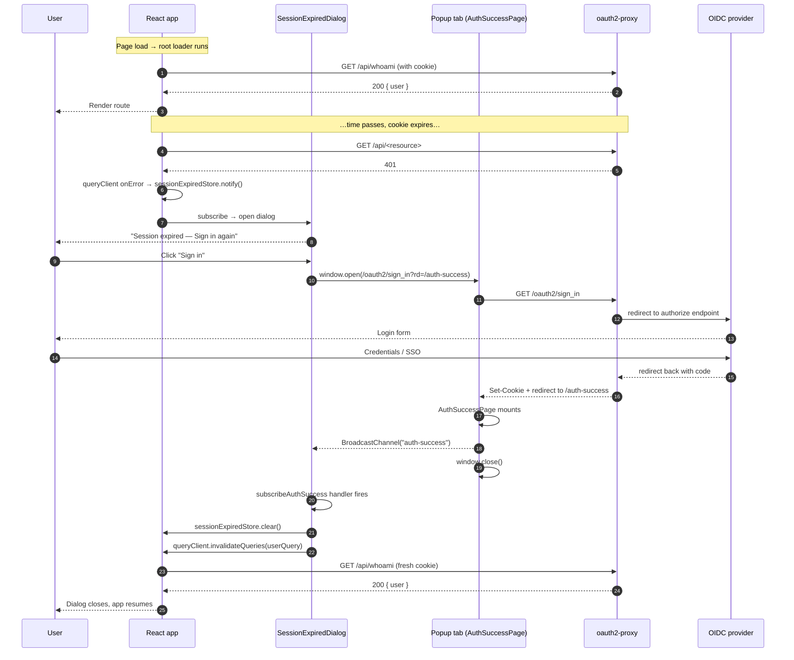

# Authentication

The web app does not talk to an identity provider directly. All
OIDC traffic terminates at an [oauth2-proxy](../oauth2/) sidecar in
front of nginx; the React app only ever sees an HTTP-only session
cookie set by the proxy and a `/whoami` endpoint exposed by the BFF.

## Topology

```text
Browser ──► nginx (auth_request) ──► oauth2-proxy ──► Equinor OIDC
              │                          │
              ├─ session cookie set/checked here
              │
              ▼
            FastAPI BFF (/api/...) ──► /whoami, /api/...
```

- **Sign in**: [`signIn()`](../src/shared/platform/auth/redirects.ts)
  navigates to `/oauth2/sign_in?rd=<current-path>`. oauth2-proxy
  performs the OIDC dance and redirects back.
- **Sign out**: [`useSignOut`](../src/shared/platform/auth/useSignOut.ts)
  posts to `/oauth2/sign_out` and clears the query cache.
- **Identity**: [`userQuery()`](../src/shared/platform/auth/userQuery.ts)
  fetches `/whoami` via the generated SDK. The cookie is sent
  automatically — no `Authorization` header is added by the client.
- **Anonymous fallback**: `assertAuthConfig` (called from
  [`bootstrap.ts`](../src/app/bootstrap.ts)) refuses to start a
  production build with the dev-only anonymous user enabled.

## Session expiry & re-auth

When a request returns 401 the SDK throws an `ApiError`; the query
client's error handler latches
[`sessionExpiredStore`](../src/shared/platform/api/sessionExpiredStore.ts).
The latch drives [`<SessionExpiredDialog />`](../src/app/auth/SessionExpiredDialog.tsx)
mounted at the root from `<AppProviders>`.

The dialog opens a popup at `/oauth2/sign_in?rd=/auth-success`. The
popup loads [`AuthSuccessPage`](../src/app/auth/AuthSuccessPage.tsx),
which broadcasts the success signal on a same-origin
`BroadcastChannel` (with a `postMessage` fallback) and closes itself.
The opener tab listens via
[`subscribeAuthSuccess`](../src/shared/platform/auth/reauthChannel.ts),
clears the latch, invalidates `userQuery`, and the rest of the cache
re-fetches lazily on next access.



## Why a popup, not a redirect

A full-page redirect would discard in-progress UI state (open forms,
unsaved input). The popup keeps the parent tab mounted, and the
handshake re-uses the existing query cache once the cookie is back.

## Why BroadcastChannel + postMessage

`BroadcastChannel` is same-origin by browser policy and works even
when COOP severs `window.opener`. `postMessage` is the fallback for
older browsers; the listener verifies `event.origin` matches
`window.location.origin` before acting.

## Module map

| Concern | File |
| --- | --- |
| `/whoami` query + types | [`userQuery.ts`](../src/shared/platform/auth/userQuery.ts) |
| Sign-in / sign-out URLs | [`redirects.ts`](../src/shared/platform/auth/redirects.ts) |
| Idle-tab session refresh | [`sessionWatcher.ts`](../src/shared/platform/auth/sessionWatcher.ts) |
| Popup ↔ opener protocol | [`reauthChannel.ts`](../src/shared/platform/auth/reauthChannel.ts) |
| Dialog state + popup launch | [`useReauthFlow.ts`](../src/shared/platform/auth/useReauthFlow.ts) |
| Popup-side one-shot effect | [`useAuthSuccessHandshake.ts`](../src/shared/platform/auth/useAuthSuccessHandshake.ts) |
| Router root loader | [`createRootLoader.ts`](../src/shared/platform/auth/createRootLoader.ts) |
| 401 latch | [`sessionExpiredStore.ts`](../src/shared/platform/api/sessionExpiredStore.ts) |
| Anonymous-user guard | [`anonymousUser.ts`](../src/shared/platform/auth/anonymousUser.ts) |
